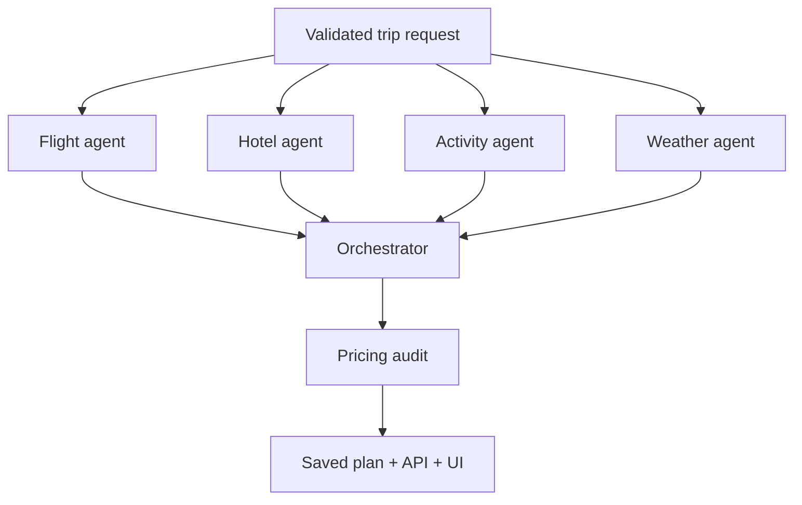

# Wayfinder — Multi-Agent AI Travel Planner

A complete, responsive trip planner that turns a destination, dates, budget and interests into a saved day-by-day itinerary. [FastAPI](https://fastapi.tiangolo.com/) serves the API and interface; [LangGraph](https://docs.langchain.com/oss/python/langgraph/graph-api) runs specialist agents in parallel. [Pydantic](https://docs.pydantic.dev/) validates every input and output. PostgreSQL stores plans in Docker; SQLite supports a quick local run.

**No API keys are required to run it.** Ten reviewed city catalogues, transparent spending allowances, budget arithmetic, trip sharing, printing and JSON export work immediately. Optional Amadeus credentials enable offer lookup; an optional OpenAI key reranks activities based on interests. External weather and open map discovery are best effort. No reservation or payment is made.

## Quick start

```bash
git clone https://github.com/Imanimtiaz2001/Imanimtiaz2001.git
cd Imanimtiaz2001/ai-travel-planner
python -m venv .venv
source .venv/bin/activate  # Windows: .venv\Scripts\activate
pip install -e '.[dev]' pytest-asyncio
uvicorn app.main:app --reload
```

Open **http://localhost:8000**. API documentation: **http://localhost:8000/docs**. Try **Istanbul**, three dates, **$1800**, and interests **history, food**. Or run `docker compose up --build` for the PostgreSQL setup. Set environment variables from `.env.example` if you want optional integrations. For Docker Compose, copy `.env.example` to `.env` and edit values.

## The problem and the design

Travelers need a plan they can inspect and adjust. A language model alone may invent attractions or prices, and a live travel search can fail or return stale availability. Wayfinder separates evidence gathering from schedule composition and keeps all money calculations deterministic.



Each specialist writes a different typed state field, so LangGraph can run them in the same superstep. The orchestrator waits for all four, ranks reviewed places against interest tags, schedules one to three activities per day according to pace, and prefers indoor places when forecast rain probability is high. An optional LLM can reorder only the supplied catalogue names; unknown names, duplicates, malformed output, or network failure fall back to deterministic ordering. The pricing agent owns the final arithmetic and never lets an LLM set a monetary figure.

**Request:** `destination`, inclusive `start_date`/`end_date` (1–7 days), total `budget_usd`, `travelers`, `interests`, optional `origin_iata`, and `pace`. **Response:** a `TravelPlan` with an evidence-tagged flight reserve/offer and hotel allowance/offer, dated schedule, group costs, line-item budget, caveats, and per-agent trace. `POST /api/plans` creates and persists it; `GET /api/plans/{uuid}` restores a shareable plan. `GET /api/destinations` lists reviewed cities. `GET /api/health` supports health checks.

## Evidence and money rules

| Source | What the app uses | Claim made to the traveler |
| --- | --- | --- |
| Reviewed city catalogue | Named places, approximate entry fees, interest tags | Place suggestion; verify access and current fees |
| OpenStreetMap / Overpass | Additional mapped places for other cities when reachable | Name and map link; unknown entry fee is excluded |
| Open-Meteo | Forecast within its horizon | Forecast, not a promise |
| Amadeus production | Optional flight and hotel search | Provider offer at retrieval time; recheck before booking |
| Amadeus sandbox | Optional sample search | Sample planning figure, never a bookable offer |
| Offline allowances | Hotel nights, meals, transit and optional flight reserve | Explicit planning estimate, never a fare or booking |

All amounts are group totals in USD. The trip dates are inclusive; check-out and return travel are the **day after** the last itinerary day. The ledger calculates `flight + hotel × nights + activities + meals + transit + ceil(10% contingency)`. A plan above budget is clearly marked infeasible rather than silently dropping costs. If departure airport is missing, flights are excluded and the omission is stated. Discovered places with unknown entry fees can make totals incomplete, so that is also stated. For long stays, the itinerary includes flexible days instead of repeating attractions.

## Why these choices

- **PostgreSQL** supports durable structured records and future filtering/analytics; SQLite reduces setup for a local demo. Both use one SQLAlchemy model. A document store is not needed for a small transactional plan service.
- **No login or JWT:** this portfolio demo saves a plan behind a random UUID link, without accounts. A commercial multi-user service would add authentication, authorization, retention controls and migrations. Never put sensitive details in a shared plan.
- **No Redis yet:** the bounded process cache is enough for a single instance demo. A distributed deployment would move token/weather caching and request throttling to Redis.
- **LangGraph** makes fan-out/fan-in and state handoff visible. Agent nodes are domain-specific tool users, while the budget is audited as code. The optional model has a narrow reranking task with validated output.
- **Server-rendered static UI with vanilla JS:** no front-end build step, fast load, no unused framework. The responsive interface supports keyboard forms, clear error states, printable output, JSON download and shareable links.

## Configuration and testing

Optional variables: `DATABASE_URL`, `AMADEUS_CLIENT_ID`, `AMADEUS_CLIENT_SECRET`, `AMADEUS_BASE_URL`, `OPENAI_API_KEY`, `OPENAI_MODEL`, `USER_AGENT`. API secrets remain server-side. The default Amadeus base URL is its **test** environment; production use requires a production account and `https://api.amadeus.com`.

```bash
pip install -e '.[dev]' pytest-asyncio
ruff check app tests
pytest -q
```

Tests cover parallel graph completion, no repeated anchors on a short trip, exact cost conservation, unaffordable trips, validation, and API persistence. Provider calls are replaced with deterministic test doubles; a passing test does **not** assert that third-party availability is current. External integrations have bounded timeouts and are optional. The public Overpass service has usage limits; use your own provider or instance for high traffic.

## Tradeoffs and extensions

Curated cities yield a reliable offline demonstration; arbitrary destinations require live OpenStreetMap discovery and may return flexible days if unavailable. Local travel times and ticket inventory are not verified, and opening hours need checking before departure. A production booking product would add provider contracts, currency conversion, geo-aware routing, room occupancy verification, migrations, per-user access control, monitoring, queue-based job execution, and rate limits. Those are deliberately not claimed here.

### Portfolio talking points

Built a typed LangGraph fan-out/fan-in workflow, integrated optional live travel/weather/map providers, constrained LLM outputs to known candidate IDs, designed failure-safe fallbacks, and verified itinerary budget invariants through API tests. The distinction between provider offers and offline allowances is a core product requirement, not a UI footnote.
