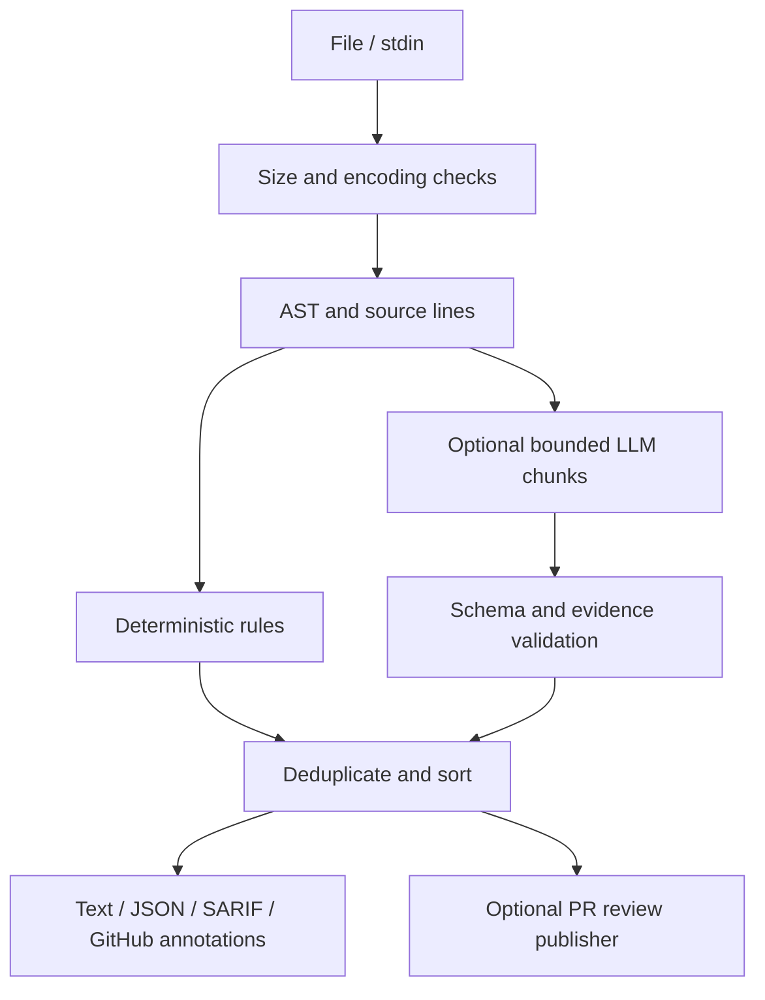

# Architecture and scope

## Problem
Python authors want fast, actionable review comments before a pull request is merged. A useful comment identifies an actual line, explains the risk, and suggests a concrete change. Static rules cover known hazards consistently; an optional language model can catch contextual maintainability issues, but its output is untrusted.

## Users and contract
The primary user is an engineer reviewing a Python file locally or in CI. Input is UTF-8 Python source up to a configured byte limit. Output is a stable list of `{path, line, end_line, rule_id, severity, message, suggestion, evidence, origin}` findings, plus warnings about skipped optional stages. Source code is never executed. A parse error produces a line finding. Exit status: 0 for no findings at the selected threshold, 1 for findings, 2 for input/configuration/provider errors.

## Data flow

The publisher posts only on added lines in a pull request and requires an explicit command and token. It does not run reviewed code. A failed LLM call does not erase static findings; warnings make the omission visible.

## API and model
The local CLI is the public API. `ReviewResult` contains findings and warnings. `Finding` uses one-based physical file lines. Rule IDs remain stable. The policy is a TOML file containing `ignore`, `max_line_length`, `max_file_bytes`, `llm_max_lines`, and `llm_max_findings`. No persistence is needed: a run is a pure transformation of source plus policy. PostgreSQL, MongoDB, Redis, JWT, and sessions would add operational state without helping this file review problem.

## Trust boundaries
Source text is untrusted, including comments that try to instruct the model. The LLM has no tools and receives numbered, bounded source as data. It must return JSON. Every candidate is rejected unless its rule, severity, line, and evidence satisfy the contract and the evidence appears on that exact source line. Credentials stay in environment variables. The LLM stage refuses files flagged by the hardcoded-secret rule, so identified credentials are not forwarded to a provider. This is a conservative guard, not a guarantee that arbitrary secrets are detected; opt in only for code approved for that provider.

## Rule choices
AST rules find executable constructs without naive keyword matching in comments or strings. A small line-length rule covers a concrete style requirement. Findings do not claim full taint analysis: `shell=True` and dynamic SQL checks point to reviewable hazards, not proof of exploitability. Configuration suppresses specific rule IDs for generated or accepted cases. The optional LLM is restricted to contextual findings and should not duplicate static rules.

## Delivery
The package is a Python 3.11+ CLI with no mandatory runtime dependency. CI runs unit and integration tests and a self-review sample. The optional GitHub publisher uses the pull request files API to restrict inline comments to changed lines and marks its review body for duplicate detection.
