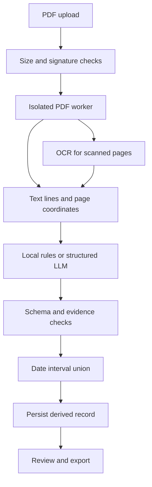

# ClearCV: design before implementation

## Problem and user
A small recruiting team receives resumes with inconsistent PDF layouts. Manually copying names, skills, education and job dates is slow; a plausible but invented field can silently enter its ATS. ClearCV extracts a fixed contract, keeps source evidence, identifies uncertain dates, and lets a human inspect/export each result. It does not rank candidates or infer protected attributes.

## Acceptance criteria
- A new clone runs without paid services and includes synthetic standard, two-column, scanned, sparse, Unicode and year-only examples.
- Every extracted fact cites existing source lines and quotes containing the exact value. Unknown fields are null, not guessed.
- Every successful response validates against the versioned Pydantic/JSON schema. Invalid model output fails closed.
- Experience is a union of dated job intervals, with lower/upper bounds for imprecise years; no overlap double counting.
- Invalid/encrypted/empty/oversized PDFs, OCR timeouts, provider outages and unsupported evidence have explicit safe errors or review warnings.
- Upload, history, evidence review, JSON/CSV download and deletion work in the UI and API.
- Original PDFs are discarded after extraction. Derived records expire after a configurable retention period and can be deleted immediately.

## Data flow

## API contract
| Method | Endpoint | Purpose |
|---|---|---|
| GET | /health/live, /health/ready | Process / DB health |
| GET | /api/config | Provider and upload limits |
| POST | /api/resumes | Bounded multipart PDF parsing |
| GET | /api/resumes?limit=20&offset=0 | Paginated recent records |
| GET | /api/resumes/{id} | Full validated result and evidence |
| DELETE | /api/resumes/{id} | Remove stored text and result |
| GET | /api/resumes/{id}/export?format=json\|csv | Machine-readable output |
| GET | /api/examples/{case} | Synthetic PDF download |
| GET | /api/metrics | PII-free Prometheus counters/histograms |

## Data model
ResumeRecord: UUID id, UTC created_at, UTC expires_at (indexed), JSON result. Result: schema_version, provider, prompt_version, extraction metadata, facts (value/quote/line_ids), jobs, education, experience estimate, warnings, source lines. Store each upload as its own record; no cross-user/document cache. A single shared operator key protects one team's data; this is not a multi-tenant identity model.

## Engineering choices and tradeoffs
| Choice | Why | Alternative / limitation |
|---|---|---|
| FastAPI + Pydantic | One typed contract generates validation and OpenAPI | Schema validity is not factual accuracy |
| React + TypeScript | Typed evidence-review UI, accessible states | No server-rendering need for this internal tool |
| PostgreSQL + SQLAlchemy | Durable records, indexed retention, transactions | SQLite enables a lightweight local launch |
| pdfplumber + PDFium + Tesseract | Coordinates, scanned fallback, permissive PDF libraries | OCR can misread characters; review remains mandatory |
| OpenAI Responses structured outputs | Schema-constrained extraction for varied semantics | API key and consent required; offline rules are less flexible |
| Deterministic evidence verification | Reject nonexistent citations and unsupported values | A quote can be genuine but semantically misclassified |
| Subprocess PDF isolation | Timeouts and Unix resource limits contain malformed files | Not an OS sandbox; trusted deployment still needs container isolation |
| Static operator API key | Small local team scope; no JWT/session complexity | For multiple tenants add OIDC plus record ownership before public use |
| No Redis / agent framework / vector DB | No repeated semantic retrieval or distributed jobs in this workflow | Add a queue when volume requires asynchronous jobs |
| Bounded concurrency | Prevent CPU/OCR overload with clear 429 responses | One API worker per container; limits are per process |

## Extraction policy
Facts are verbatim, normalized only for Unicode/whitespace comparisons. Local extraction is deliberately conservative and vocabulary-limited. LLM prompts treat the document as untrusted data, never instructions; the model cannot call tools. Evidence checks do not constitute a prompt-injection proof. Work dates must be source-supported and parseable. Year-only intervals produce a range. Future or reversed dates are excluded with a warning. All extracted records require human review; no confidence probabilities are fabricated.

## Evaluation strategy
Synthetic gold cases cover conventional layouts, sidebars, raster scans, Unicode, year-only dates, empty fields, invalid PDFs and adversarial text. Field exact match and skill precision/recall are measured separately from schema validity. Unit/property tests cover interval unions, schema validation and fabricated evidence. Integration tests cover real uploads, auth, retention, deletion, CSV injection and provider contract/failure paths. Browser tests cover the review workflow and errors. Synthetic results are not claims of general resume accuracy.
