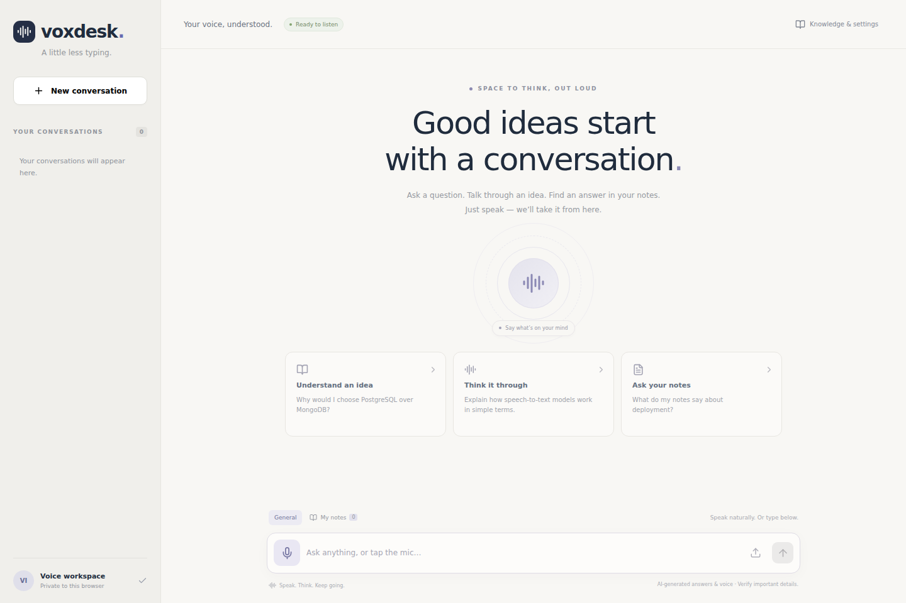

# VoxDesk · a little less typing

A voice knowledge assistant for people thinking through technical ideas and reviewing their notes. Speak a question, see the transcript, get a concise answer, and hear it read aloud. General mode answers ordinary questions; **My notes** mode retrieves your own passages, validates citation IDs, and abstains when there is no usable evidence.



The project implements the full **speech-to-text → language model → text-to-speech** loop with separate, replaceable adapters. It includes a responsive React interface, persisted conversations, private note collections, hybrid retrieval, recoverable speech failures, request replay, metrics, tests, migrations, and two deployment profiles.

## Run it

### No paid API key: local Docker setup

Install Docker Desktop with Compose (Windows/macOS) or Docker Engine + Compose (Linux). From this directory:

```bash
docker compose -f compose.yaml -f compose.local.yaml up --build -d
```

Open **http://localhost:8000** after the model initialization services finish. The first run downloads several GB of model files; allow at least **8 GB available RAM**, roughly **8 GB disk**, and Internet access for that initial setup. Subsequent inference runs locally. CPU inference works; its speed depends on your hardware. Inspect progress with:

```bash
docker compose -f compose.yaml -f compose.local.yaml logs -f ollama-init whisper-init api
```

The local stack uses **faster-whisper base → Qwen2.5 3B through Ollama → eSpeak NG**, plus nomic embeddings. eSpeak's voice is intentionally synthetic; the cloud profile produces a more natural voice. English and Urdu are supported options, with language quality dependent on each model. Changing a model changes its behavior and may require more RAM.

### Cloud Docker setup

Copy `.env.example` to `.env`, set `PROVIDER=openai`, and add your own `OPENAI_API_KEY`. Keep the key on the server; the frontend never receives it.

```bash
docker compose up --build -d
```

Open **http://localhost:8000**. The default adapters use `gpt-4o-mini-transcribe`, `gpt-4.1-mini`, `gpt-4o-mini-tts`, and `text-embedding-3-small` with 768-dimensional embeddings. Models are configurable. Cloud inference requires API access, quota and credits; a ChatGPT subscription is separate. A configured key is a readiness check, not a guarantee of model access or remaining quota.

### Develop without Docker

Requirements: Python 3.12+, uv, Node.js 24+, FFmpeg. For local mode also install Ollama and eSpeak NG, then run Ollama. On Linux, `sudo apt-get install ffmpeg espeak-ng` installs the audio tools. Windows/macOS users can use the Docker local profile without native speech-tool setup.

```bash
cp .env.example .env
# Local mode: download the models once.
./scripts/local-setup.sh
./scripts/dev.sh
```

For cloud mode, set the key and `PROVIDER=openai` in `.env`, skip `local-setup.sh`, then run `dev.sh`. The script installs locked dependencies, builds the web UI, applies database migrations and serves the app at **http://localhost:8000**. Development defaults to SQLite. For frontend hot reload, run `npm run dev --prefix frontend` in a second terminal; its API proxy targets the backend on port 8000.

## Try the complete workflow

1. Tap the microphone, speak a short question, then tap Stop. The recording is automatically stopped at 60 seconds. Or upload a recording / type a question.
2. Read the transcript and answer, and listen to generated speech. **Edit question** copies a transcript into the composer for correction and resubmission.
3. Open **Knowledge & settings**, upload `evals/notes.md`, then choose **My notes**.
4. Ask “What happens to microphone recordings?” Expand a source to inspect the actual supporting passage.
5. Switch languages or cloud voices, stop playback, replay an answer, export history, or delete a conversation / note.

Notes must be UTF-8 `.txt` or `.md`; audio accepts formats FFmpeg can decode, including browser WebM/M4A and WAV/MP3. PDFs, camera input and scanned documents are outside this project's scope. “Multimodal” here means **audio and text**, not image understanding. Browser microphone capture requires HTTPS or localhost. AI-generated voice is disclosed in the interface.

## Architecture and engineering decisions

See [design and prototype](docs/DESIGN.md), [API guide](docs/API.md), [operations](docs/OPERATIONS.md), [verification evidence](docs/VERIFICATION.md), and [interview walkthrough](docs/INTERVIEW.md).

| Layer | Technology | Concrete purpose |
|---|---|---|
| Browser | React 19, TypeScript, Vite, MediaRecorder, HTML Audio | Capture, state transitions, transcript correction, playback, drawers and history |
| API | FastAPI, Pydantic, async Python | Typed requests, streaming-body limits, ownership and provider errors |
| Workflow | LangGraph | Explicit retrieval → structured answer → citation validation |
| Cloud models | OpenAI Audio / Responses / Embeddings APIs | Independent transcription, reasoning, synthesis and semantic representations |
| Local models | faster-whisper, Ollama/Qwen, nomic, eSpeak NG | Complete local voice loop with no paid API key |
| Storage | PostgreSQL, SQLAlchemy, Alembic, pgvector | Atomic saved turns, lock leases, private documents and native vector distance |
| Retrieval | BM25 + cosine rank fusion | Match exact terms and semantic similarity in a bounded private corpus |
| Limits | Redis | Shared request budgets across replicas |
| Observability | Prometheus, structured logs, trace IDs | Per-stage latency and failures without logging questions or notes |
| Verification | pytest, Vitest, Testing Library, Playwright | API, provider-wire, component, desktop/mobile and microphone tests |
| Delivery | Docker Compose, GitHub Actions, locked dependencies | Reproducible builds and repeatable checks |

This is a bounded workflow, not an autonomous agent. The model does not execute shell commands, browse, or perform account actions. LangGraph is used to make stages and validation explicit. The project deliberately avoids adding unrelated frameworks just to list more technologies.

PostgreSQL holds both relational data and embeddings; a second vector database is unnecessary at the enforced **20 notes / 200 chunks per browser** limit. SQLite uses JSON vectors and Python cosine distance for portable development. PostgreSQL uses pgvector's distance operator. There is no approximate-nearest-neighbor index at this corpus size; add one after measuring a larger workload. Opaque HttpOnly session cookies fit an anonymous browser workspace; JWTs would add key rotation and token revocation complexity without solving a current requirement. Redis stores counters, not generated answers.

## Reliability and privacy

- Recordings are limited to 10 MB / 60 seconds, decoded in a constrained FFmpeg subprocess, normalized to mono 16 kHz PCM and checked for silence before transcription. Audio input is not persisted.
- Conversation leases serialize turn writes across replicas. Request IDs prevent duplicate saved turns on retries; reusing an ID with different input returns 409.
- A TTS failure saves the text answer and exposes **Retry voice**. A transcription or answer failure saves no partial turn.
- Cancellation stops browser waiting; an already-running server turn may complete. Reopen the conversation or retry the same request ID to recover its result. Native local transcription remains serialized even after cancellation.
- All notes, history and audio routes check the owning session. There is no cross-browser access by guessing resource IDs. Cloud mode sends audio, questions and relevant passages to the provider.
- Knowledge mode checks that returned citation IDs came from the retrieved passages. This checks citation existence; it is not a mathematical guarantee that every claim is entailed. Prompt-injection resistance and answer relevance still require live evaluations and review.
- No raw transcript or document text is written to operational logs. Generated audio and history stay until the conversation is deleted. Old note embeddings are excluded after changing embedding providers/models; the UI asks you to delete and re-upload those notes.

## Test and evaluate

```bash
uv sync --frozen --extra dev
uv run --no-sync ruff check backend migrations scripts
uv run --no-sync ruff format --check backend migrations scripts
uv run --no-sync pytest --cov=voxdesk --cov-report=term-missing
uv run --no-sync python scripts/evaluate.py
npm ci --prefix frontend
npm test --prefix frontend
npm run build --prefix frontend
cd frontend
npx playwright install --with-deps chromium
npm run e2e
```

The fixture adapter is deterministic and **can only run in `ENVIRONMENT=test`**. It is clearly labeled in the UI and cannot be used to pretend model inference occurred. Offline evaluation checks lexical retrieval with fixture vectors; it is not a semantic model or model-quality benchmark. To run actual model checks after setting up a real provider:

```bash
# Local mode needs the optional speech dependencies installed as well.
uv sync --frozen --extra dev --extra local
uv run --no-sync python scripts/live_smoke.py
uv run --no-sync python scripts/evaluate.py --live --output docs/live-evaluation.json
```

Live evaluation makes real model calls; cloud mode can incur API charges. The synthetic speech smoke test proves pipeline interoperability, not accuracy on natural speech, accents or noisy microphones. Infrastructure tests additionally run when `TEST_POSTGRES_URL` and `TEST_REDIS_URL` are set. The repository workflow enables those services and builds the container.

## Honest scope

VoxDesk is an implemented portfolio project with production-oriented controls, not a claim of production traffic or an enterprise SaaS. It uses complete short turns rather than realtime token/audio streaming. It has anonymous browser workspaces rather than account login, and text/Markdown ingestion rather than OCR. Expose it publicly only behind HTTPS and appropriate ingress authentication, especially when using a paid provider. See the operations guide for those concrete deployment settings.
