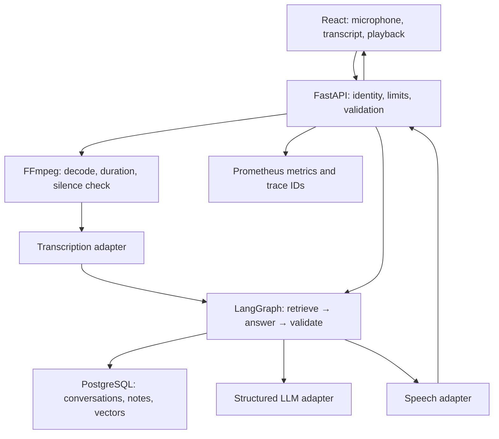
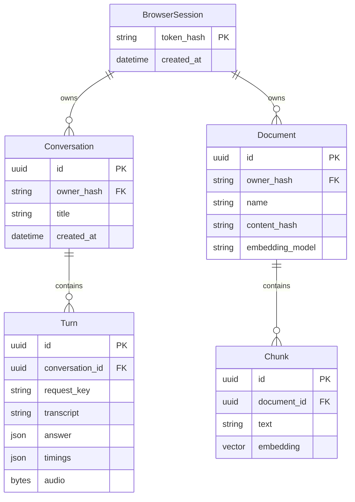

# VoxDesk: design before implementation

## Problem and user
People reviewing technical notes cannot always type or switch between documents. A voice knowledge assistant should accept a short spoken question, make the transcript visible, retrieve relevant passages when knowledge mode is selected, produce a concise grounded answer, and read it aloud. The user remains in control of microphone capture and playback. No bookings, payments, external actions or fabricated live data.

## Product contract
Push-to-talk or upload audio; editable transcript and text input; general and knowledge modes; English/Urdu input; concise spoken answer with separately visible citations; persistent conversations; private per-browser knowledge collection; export/delete history; upload/delete text or Markdown notes; cancel a request; replay or stop speech; per-stage timings; visible errors. AI-generated voice is explicitly disclosed. Cloud uses three distinct models. Local uses faster-whisper, Ollama and eSpeak NG. Test fixtures are explicitly a test provider, never represented as live AI.

## Wireframe prototype
Desktop: narrow sidebar (brand, new conversation, history, mode); large conversation column (intro, suggestion cards, messages, sticky microphone/text composer); right drawer (notes, uploads, source excerpts, timings). Mobile: a single conversation column with history and knowledge drawers. Palette: warm ivory, deep navy, muted indigo; readable typography, rounded panels; recording has a red indicator and elapsed timer; loading stages announce via an ARIA live region.

## Boundaries and data flow

The graph is a bounded workflow, not an autonomous agent. It cannot execute arbitrary tools. Retrieval mixes lexical and semantic ranks using reciprocal rank fusion. Context and citations are scoped to an opaque browser session. Knowledge answers must cite supplied chunk IDs or abstain. An untrusted document is evidence, never an instruction. Transcript, answer and generated audio are committed together after generation; TTS failure commits a text answer with a recoverable warning. Audio input is transient and never saved. Audio output is stored with the turn and deleted with its conversation.

## Data model

Unique conversation/request key prevents duplicate turns. A database lock lease serializes writes per conversation; expired leases recover after process termination. Sessions are opaque server-issued HttpOnly cookies, same-origin checks protect mutations, and IDs are never authorization. Production requires HTTPS and secure cookies. No JWT because this is an anonymous single-browser workspace with server-side revocation; adding accounts would require a separate identity contract.

## API contract
| Method | Path | Behavior |
|---|---|---|
| GET | /api/config | Session bootstrap and available provider capabilities |
| GET/POST | /api/conversations | List/create owned conversations |
| GET/DELETE | /api/conversations/{id} | Read/delete owned history |
| GET | /api/conversations/{id}/export | JSON export without audio |
| POST | /api/conversations/{id}/turns | Multipart text OR audio, request_id UUID, mode, language, voice |
| GET | /api/turns/{id}/audio | Authorized generated audio |
| POST | /api/turns/{id}/speech | Retry failed speech generation |
| GET/POST | /api/documents | List/upload owned UTF-8 .txt/.md notes |
| DELETE | /api/documents/{id} | Delete document and chunks |
| GET | /health/live, /health/ready | Liveness, database/provider dependencies |
| GET | /metrics | Content-free operational metrics |

## Failure and resource budget
Audio: maximum 10 MB, 60 seconds, ffmpeg timeout, mono 16 kHz PCM. Text: 4,000 characters. Notes: 256 KB each, 20 documents and 200 chunks per browser. Context: six chunks, last six truncated turns, bounded spoken output. Reject empty/silent/corrupt media before paid transcription. Bound request body before multipart parsing. Provider timeout and at most two cloud retries for transient errors; no retries for rejected credentials. Per-IP request limits via Redis when configured, bounded single-process limiter otherwise. Leased conversation locks return 409 on overlap. Cancellation discards client results; a completed server turn can be recovered by refreshing history or retrying the same request ID. No claim of token/audio streaming: this deliberately uses complete short turns.

## Decision records
- FastAPI + Python: async model APIs, typed contracts, access to speech ecosystem.
- React + TypeScript + Vite: browser audio lifecycle needs explicit state, strong types and component tests; SSR adds no value here.
- PostgreSQL + pgvector: transactional conversation storage and vector retrieval in one operational service. SQLite JSON vectors keep small local tests portable. PostgreSQL uses native vector distance; lexical ranking is bounded in Python for this corpus size.
- LangGraph: observable explicit retrieve/generate/validate workflow; no unnecessary agent swarm.
- Redis: shared rate limits across replicas; no user-answer cache because conversations and private knowledge change output and create privacy risk.
- Three model adapters: diagnose STT vs answer vs TTS failures independently; local and cloud providers share typed contracts.
- WAV output: reliable HTML audio playback and deterministic file handling; trades bandwidth for portability.
- Notes only: deliberate UTF-8 text/Markdown ingestion avoids pretending scanned PDFs have been OCR'd.

## Acceptance gates
API integration tests cover ownership, request replay, overlap, silence/corrupt audio, duration, upload limits, provider errors, citation validation, abstention and TTS recovery. UI tests cover success, errors, history and upload. Browser verification covers desktop/mobile and fake microphone capture. Offline evaluation includes retrieval and citation/abstention checks. Live model calls are only counted as verified when actually run with available credentials or local models.
